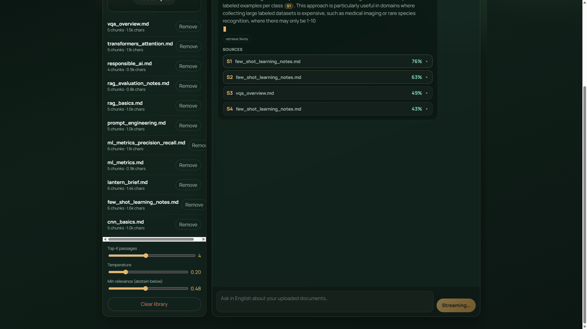
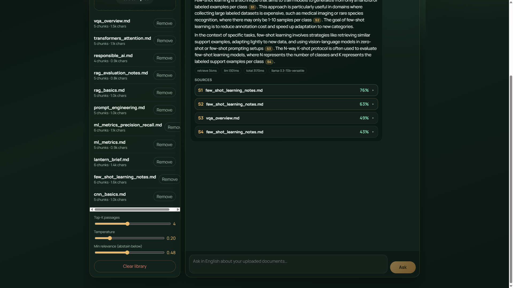
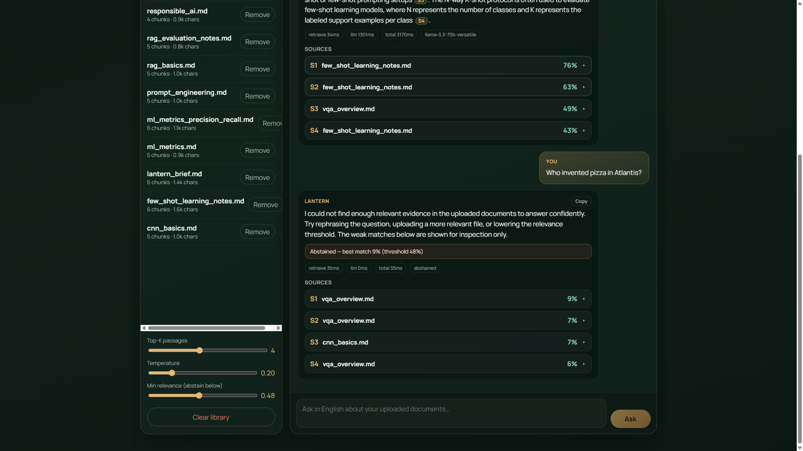
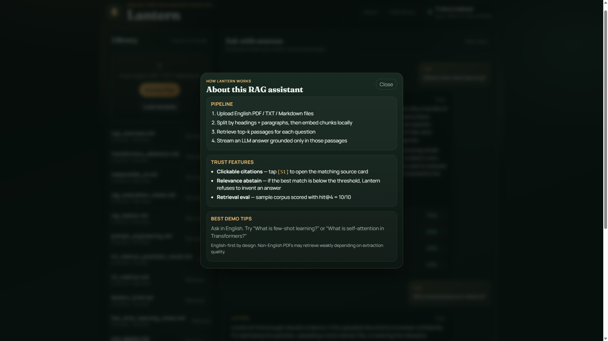

# Lantern — RAG Chatbot (Full Stack)

English-first Retrieval-Augmented Generation assistant for private documents.  
Lantern retrieves relevant passages, **streams** an LLM answer, and shows **source citations + relevance scores**.



## Stack
- **Backend:** FastAPI · ChromaDB · Sentence-Transformers · OpenAI-compatible LLM (Groq / OpenAI / Ollama)
- **Frontend:** React + Vite · custom Lantern UI (streaming, citations, About panel)

## Quick start (Windows)

### 1) API key
```powershell
cd rag-chatbot
copy .env.example .env
```
Edit `.env`:
```env
LLM_PROVIDER=groq
GROQ_API_KEY=your_key_here
LLM_MODEL=llama-3.3-70b-versatile
MIN_RELEVANCE=0.48
```
Free Groq key: https://console.groq.com

### 2) Backend
```powershell
.\start-backend.ps1
```
Docs: http://127.0.0.1:8000/docs

### 3) Frontend (new terminal)
```powershell
.\start-frontend.ps1
```
Open: http://127.0.0.1:5173

### 4) 60-second demo
1. Click **Load samples**
2. Ask: *What is few-shot learning?*
3. Click a citation chip like `[S1]` to open the source card
4. Ask something irrelevant (e.g. *Who rules Atlantis?*) to see **abstain**
5. Open **About** for the product explanation

| Grounded answer + citations | Abstain on weak evidence |
|---|---|
|  |  |



## Sample corpus (`data/sample_docs/`)
| File | Topic |
|------|--------|
| `few_shot_learning_notes.md` | Few-shot / N-way K-shot |
| `vqa_overview.md` | Visual Question Answering |
| `lantern_brief.md` | Product behavior of Lantern |
| `rag_evaluation_notes.md` | Mini retrieval evaluation checklist |
| `rag_basics.md` | RAG pipeline & failure modes |
| `transformers_attention.md` | Transformers / self-attention |
| `cnn_basics.md` | Convolutional neural networks |
| `ml_metrics.md` | Precision, recall, F1 |
| `prompt_engineering.md` | Grounded prompting tips |
| `responsible_ai.md` | Short responsible-AI checklist |

## Suggested demo questions
- What is few-shot learning?
- What challenges exist in Visual Question Answering?
- How does Lantern generate answers?
- What is self-attention in Transformers?
- Explain Retrieval-Augmented Generation in one paragraph.
- What is the difference between precision and recall?

## Retrieval evaluation
Lantern includes a small offline retrieval benchmark over the English sample corpus.

```powershell
cd rag-chatbot
.\.venv\Scripts\python scripts\evaluate_retrieval.py --k 4
```

Latest run (**hit@4**): **10/10 (100%)**

| ID | Question | Hit@4 |
|----|----------|-------|
| Q1 | What is few-shot learning? | PASS |
| Q2 | What is the N-way K-shot protocol? | PASS |
| Q3 | What challenges exist in Visual Question Answering? | PASS |
| Q4 | How does Lantern generate answers? | PASS |
| Q5 | What is self-attention in Transformers? | PASS |
| Q6 | Explain Retrieval-Augmented Generation in one paragraph. | PASS |
| Q7 | What is the difference between precision and recall? | PASS |
| Q8 | What are the core building blocks of a CNN? | PASS |
| Q9 | What prompt engineering rules help grounded RAG assistants? | PASS |
| Q10 | What belongs on a responsible AI checklist? | PASS |

Details: `data/eval_results.md` · cases: `scripts/eval_cases.json`

A case counts as a hit when top-k retrieval returns the expected source file **and** keyword evidence from that topic.

## Features
- Multi-file upload (PDF / TXT / MD) + drag & drop
- One-click **sample document seeding**
- **Heading-aware chunking** (markdown sections + paragraph packing)
- Chunking + local embeddings (persistent Chroma)
- **SSE streaming** answers grounded in retrieved context
- Source cards with filename, page, score bar, expandable snippet
- Clickable `[S1]` citations that open the matching source card
- Relevance abstain: if best match is below `MIN_RELEVANCE`, Lantern refuses to invent an answer
- **About** panel explaining the pipeline for demos/interviews
- **Voice (English):** Mic records audio → Groq Whisper transcription; Speak reads answers aloud
- Top-K + temperature + min-relevance controls
- Latency meta (retrieve / llm / total)
- Copy answer · new chat · library clear

## Notes
- **English-first:** sample docs and prompts are optimized for English demos. Non-English PDFs may retrieve, but answer quality depends heavily on extraction quality.
- After changing chunking, click **Clear library** then **Load samples** so documents are re-indexed.
- First backend start downloads the embedding model (~90MB).
- For fully local LLM: set `LLM_PROVIDER=ollama` and run Ollama with `llama3.2`.

## Resume blurb
> Built **Lantern**, a full-stack RAG system with FastAPI, ChromaDB, heading-aware chunking, local sentence embeddings, streaming generation, clickable citations, relevance-based abstention, Whisper transcription, and an offline retrieval benchmark (hit@4) on a multi-topic corpus.
